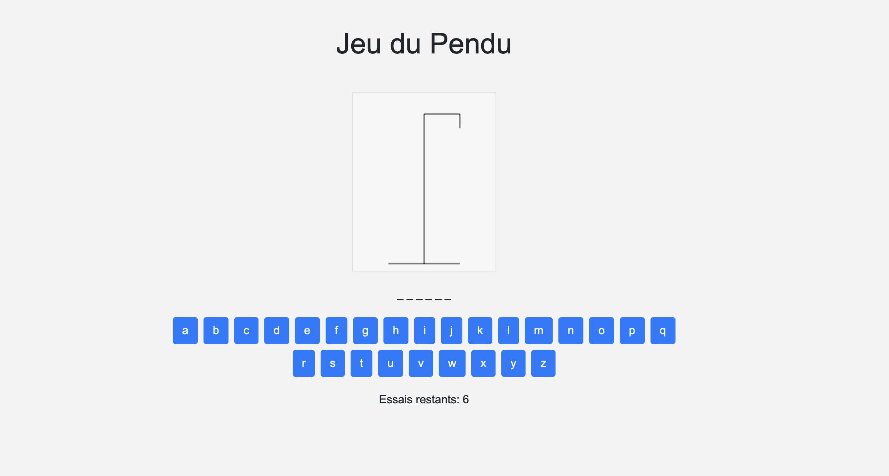

# Jeu du Pendu (Hangman) en JavaScript

Un jeu classique du Pendu (Hangman) construit en utilisant JavaScript, HTML et CSS. Dans ce jeu, les joueurs doivent deviner un mot en proposant des lettres. Le jeu inclut un système de comptage des coups, une liste de mots à deviner et la possibilité de dessiner un pendu progressivement à chaque mauvaise lettre proposée par le joueur.

## Fonctionnalités

- Devinez le mot en proposant des lettres.
- Limitez le nombre de coups avant d'échouer.
- Dessinez le pendu progressivement en cas de mauvaise proposition.
- Utilisation d'une liste de mots pré-définie.
- Personnalisation possible de la liste de mots.
- Affichage de l'état actuel du mot avec les lettres correctes devinées.
- Compteur de coups restants.
- Gestion des lettres déjà proposées.

## Captures d'écran

## Comment jouer

1. Ouvrez le fichier `index.html` dans votre navigateur web.
2. Le jeu sélectionnera aléatoirement un mot à deviner à partir de la liste.
3. Proposez des lettres en cliquant sur les boutons correspondants ou en utilisant le clavier.
4. Devinez le mot avant d'épuiser le nombre de coups autorisés.

## Personnalisation

Vous pouvez personnaliser ce jeu en modifiant la liste de mots dans le fichier JavaScript (`hangman.js`) ou en ajoutant des fonctionnalités supplémentaires comme des catégories de mots, des indices, etc.

## Contribution

Les contributions sont les bienvenues ! Si vous souhaitez améliorer ce jeu ou ajouter de nouvelles fonctionnalités, n'hésitez pas à soumettre une demande de tirage (pull request).